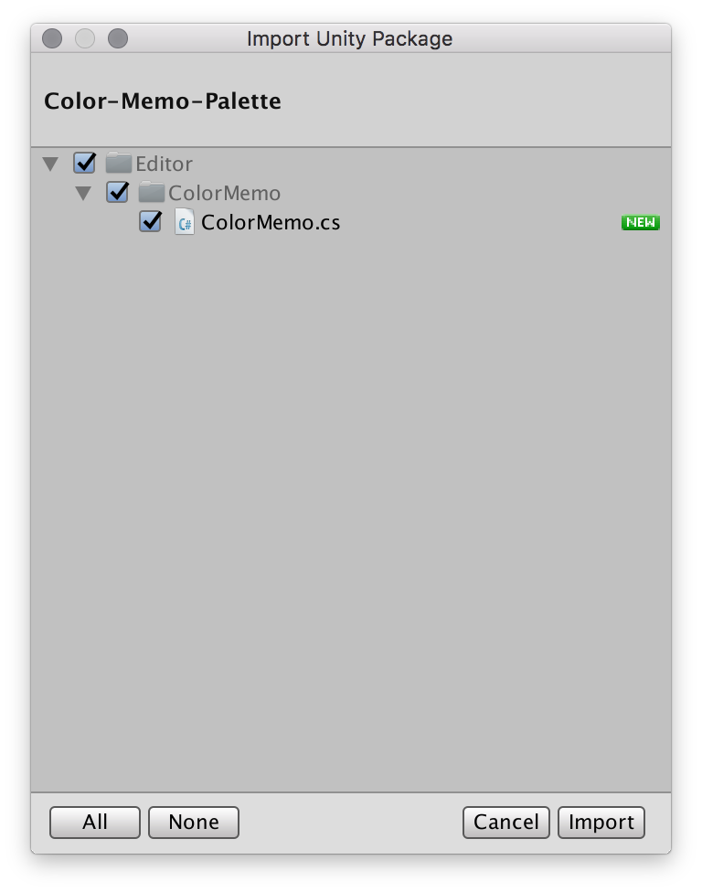
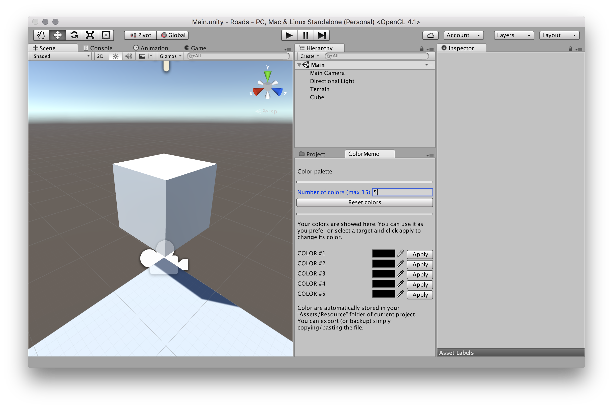
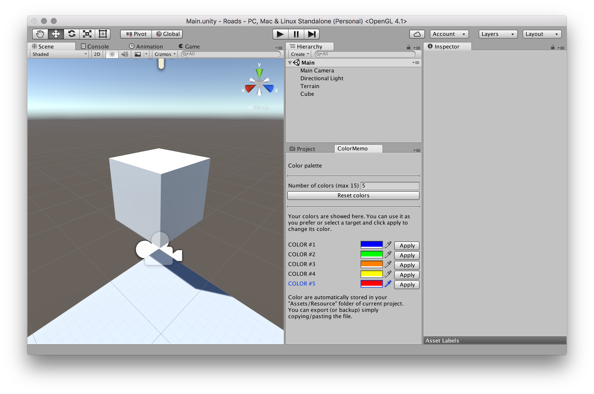
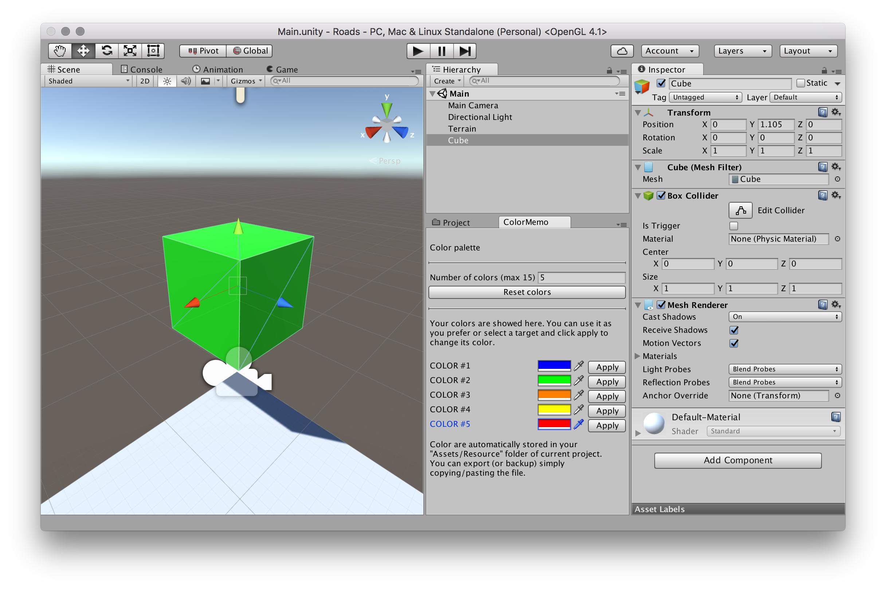
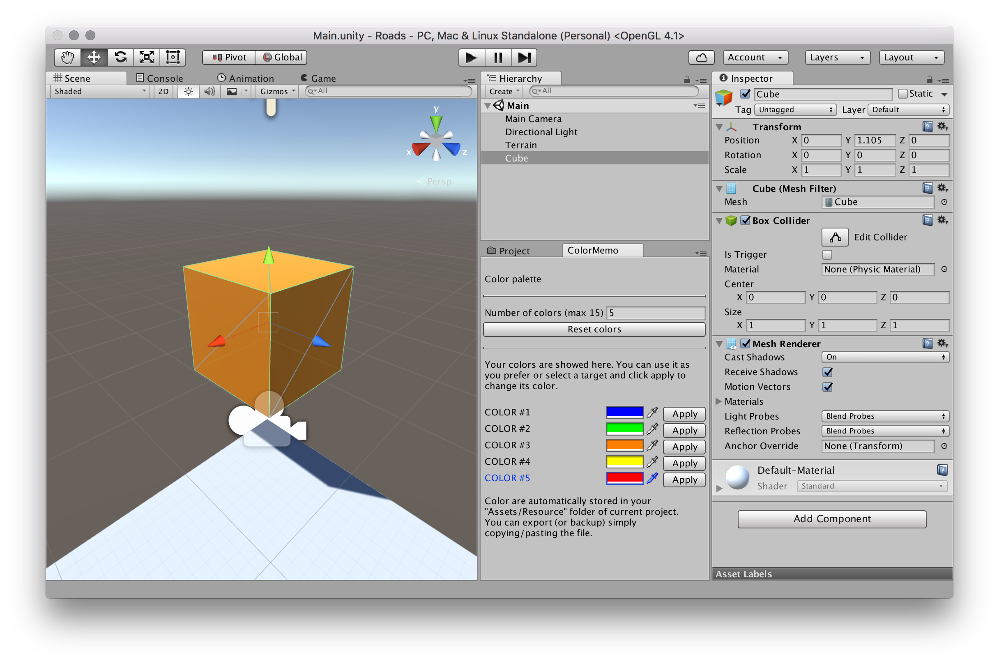
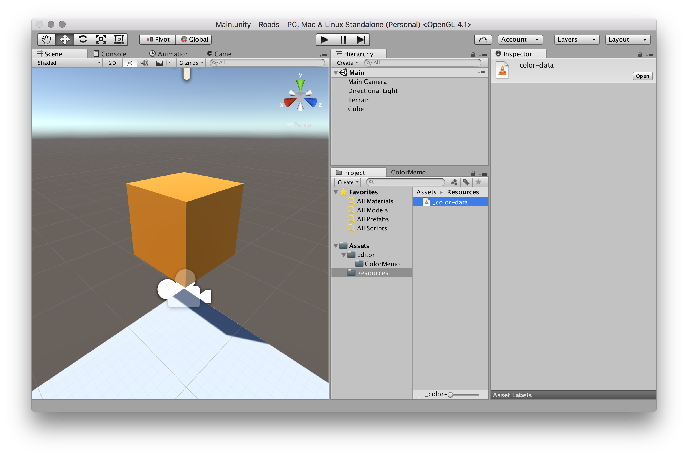

# Unity3D - Color Palette (Editor Plugin)

A Unity3d editor plugin to save/use a custom color palette for your projects.

---
### How to use?
1) Import the **Color-Memo-Palette.unitypackage** or double click on it to install.  

2) Open menu **Window->Color Palette** to open the new panel.  
Drag and snap where you want.

---

How it appear after snapped in the editor:  

You can add colors, change, edit and what you want:  

Selecting your **gameObject**, and next "*Apply*" you can change color directly from the palette:  

Data is automatically saved in your project folder. In particular to the "**Assets/Resources/_color-data.dat**".  
You can use this file to copy/paste in another project or to backup.  

####Limitation
- Not a limitation, but a dev limit, you can add max 15 colors (but you can change it from code).

Feel free to update this snippet and ask for a pull request.
