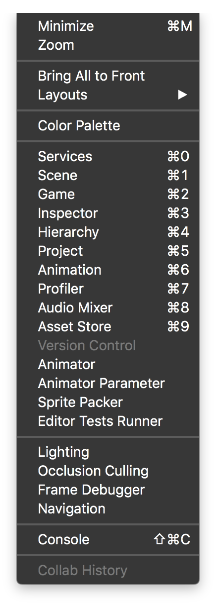

# Unity3D - Color-Set memo editor plugin

A Unity3d editor plugin to save a custom set colors for your projects.

---
### How to use?
Drag the source *C#* code (**ColorMemo.cs**) file in your projects.  
That's all!

Open menu **Window->ColorMemo** to open the new panel. Drag where you want.

### Limitations:
As version 0.1 of this plugin, you can add new colors editing the source code file.

### Todo:
- Add colors direct from Panel
- Save added colors in the storage

Feel free to update this snippet or wait my future updates... when i'm inspired :)

